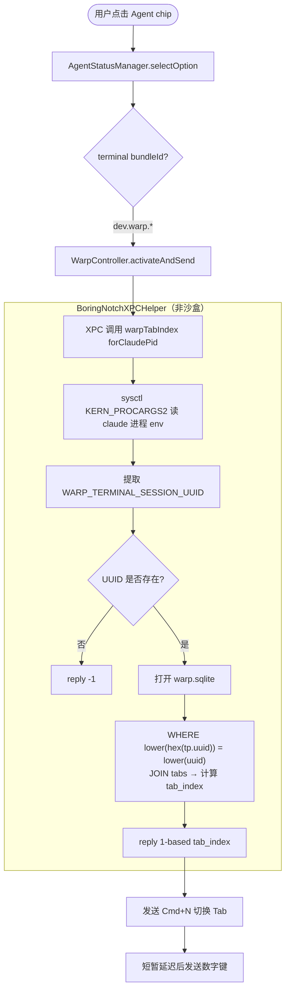
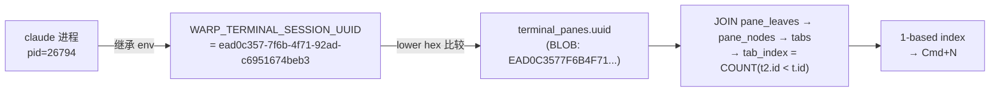
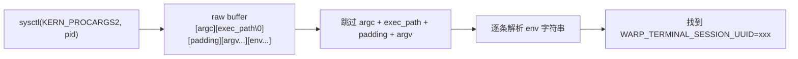

# Warp Tab 切换数据流

## 概述

boringNotch 点击 Agent chip 时，需要精确切换到对应的 Warp Tab 并发送数字键。  
核心问题是从 **claude 进程** 定位到它所在的 **Warp pane**，再换算出 **tab 视觉位置**。

---

## 关键发现

| 信息 | 来源 |
|---|---|
| `WARP_TERMINAL_SESSION_UUID` | Warp 在每个 pane 启动 shell 时注入的环境变量，全局唯一 |
| `terminal_panes.uuid` | Warp SQLite DB 中与上述 UUID 一致的 BLOB 字段 |
| tab 视觉顺序 | `SELECT COUNT(*) FROM tabs t2 WHERE t2.id < t.id`（按 DB 插入顺序，与 Warp 界面一致） |

> **注意**：Warp `tabs` 表没有 `position` 字段，拖拽顺序即 `id` 插入顺序，两者始终一致。

---

## 数据流



---

## UUID 匹配原理



---

## SQL 查询

```sql
SELECT
    (SELECT COUNT(*) FROM tabs t2
     WHERE t2.window_id = t.window_id AND t2.id < t.id) AS tab_index
FROM terminal_panes tp
JOIN pane_leaves pl ON pl.pane_node_id = tp.id
JOIN pane_nodes pn ON pn.id = pl.pane_node_id
JOIN tabs t ON t.id = pn.tab_id
WHERE lower(hex(tp.uuid)) = lower(replace(?, '-', ''))
```

- `?` 绑定 `WARP_TERMINAL_SESSION_UUID` 的值
- 结果为 0-based，+1 后即 Cmd+N 的 N

---

## 进程 env 读取（Swift）

macOS 通过 `sysctl(KERN_PROCARGS2)` 读取目标进程的完整 argv + env：



claude 进程从 zsh fork，完整继承了 Warp 注入的环境变量，因此直接读 claude pid 即可，无需追溯父进程。

---

## 数据库位置

```
~/Library/Group Containers/2BBY89MBSN.dev.warp/Library/Application Support/dev.warp.Warp-Stable/warp.sqlite
```

XPCHelper 以 `SQLITE_OPEN_READONLY` 打开，不修改数据。
